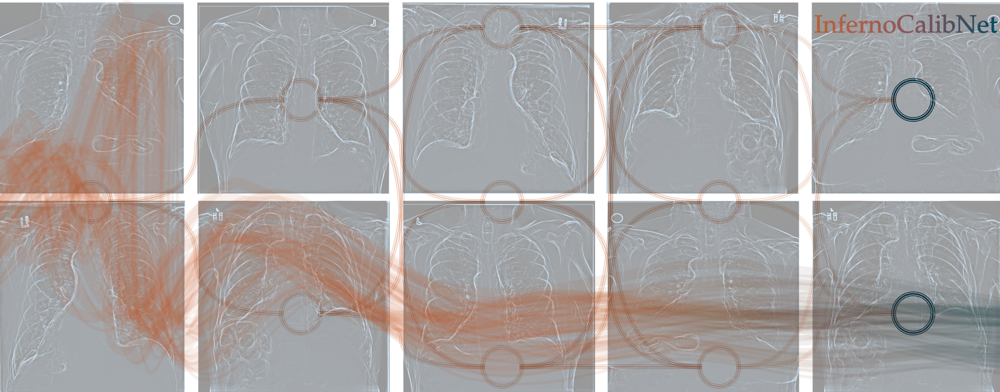

<h1 align="center">
  🧠InfernoCalibNet🔥
</h1>

<p align="center">
  
</p>

> **Calibration modeling for CNN outputs using Bayesian nonparametric inference**

[](LICENSE.md)
[](CODE_OF_CONDUCT.md)

---

## 🔍 Table of Contents

- [📊 Overview](#-overview)
- [📂 Repository Structure](#-repository-structure)
- [🔧 Installation](#-installation)
- [👣 Quick Start](#-quick-start)
- [🔄 Usage Examples](#-usage-examples)
- [📄 Documentation](#-documentation)
- [🌟 Acknowledgements](#-acknowledgements)

---

## 📊 Overview


## 📂 Repository Structure


## 🔧 Installation


## 👣 Quick Start

> **Note:** The Inferno R-package provides Bayesian nonparametric calibration for CNN outputs.

### Clone the repository without submodules

```bash
git clone https://github.com/589664/InfernoCalibNet.git
```

### Clone the repository with submodules

```bash
git clone --recurse-submodules https://github.com/589664/InfernoCalibNet.git
```

### If already cloned without submodules

```bash
git submodule update --init --recursive
```

## 🔄 Usage Examples


## 📄 Documentation


## 🌟 Acknowledgements

*Maintained with love & passion by [@m4siko](https://github.com/m4siko)* 🚀
